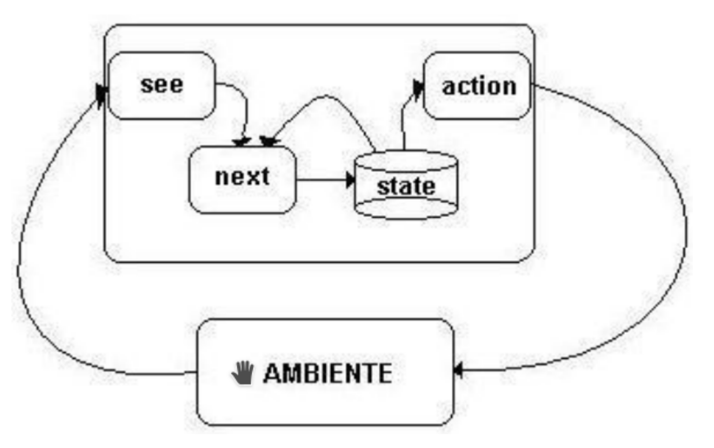

# Proyecto Simulación-Programación Declarativa

Luis Ernesto Ibarra Vázquez C411

## Problema

El ambiente en el cual intervienen los agentes es discreto y tiene la forma de
un rectángulo de N × M . El ambiente es de información completa, por tanto
todos los agentes conocen toda la información sobre el agente. El ambiente puede
varı́ar aleatoriamente cada t unidades de tiempo. El valor de t es conocido.

Las acciones que realizan los agentes ocurren por turnos. En un turno, los
agentes realizan sus acciones, una sola por cada agente, y modifican el medio
sin que este varı́e a no ser que cambie por una acción de los agentes. En el
siguiente, el ambiente puede variar. Si es el momento de cambio del ambiente,
ocurre primero el cambio natural del ambiente y luego la variación aleatoria.
En una unidad de tiempo ocurren el turno del agente y el turno de cambio del
ambiente.

Los elementos que pueden existir en el ambiente son obstáculos, suciedad,
niños, el corral y los agentes que son llamados Robots de Casa. A continuación
se precisan las caracterı́sticas de los elementos del ambiente:

- **Obstáculos**:
  - Estos ocupan una única casilla en el ambiente. Ellos pueden ser
    movidos, empujándolos, por los niños, una única casilla. El Robot de Casa
    sin embargo no puede moverlo. No pueden ser movidos ninguna de las
    casillas ocupadas por cualquier otro elemento del ambiente.
- **Suciedad**:
  - La suciedad es por cada casilla del ambiente. Solo puede aparecer
    en casillas que previamente estuvieron vacı́as. Esta, o aparece en el estado
    inicial o es creada por los niños.
- **Corral**:
  - El corral ocupa casillas adyacentes en número igual al del total de niños presentes en el ambiente. El corral no puede moverse. En una casilla del
    corral solo puede coexistir un niño. En una casilla del corral, que esté vacı́a,
    puede entrar un robot. En una misma casilla del corral pueden coexistir
    un niño y un robot solo si el robot lo carga, o si acaba de dejar al niño.
- **Niño**:
  - Los niños ocupan solo una casilla. Ellos en el turno del ambiente se mueven, si es posible (si la casilla no está ocupada: no tiene suciedad, no está el
    corral, no hay un Robot de Casa), y aleatoriamente (puede que no ocurra
    movimiento), a una de las casilla adyacentes. Si esa casilla está ocupada
    por un obstáculo este es empujado por el niño, si en la dirección hay más
    de un obstáculo, entonces se desplazan todos. Si el obstáculo está en una
    posición donde no puede ser empujado y el niño lo intenta, entonces el
    obstáculo no se mueve y el niño ocupa la misma posición.
  - Los niños son los responsables de que aparezla suciedad. Si en una cuadrı́cula de 3 por 3 hay un solo niño, entonces, luego de que él se mueva aleatoriamente, una de las casillas de la cuadrı́cula anterior que esté vacı́a puede
    haber sido ensuciada. Si hay dos niños se pueden ensuciar hasta 3. Si hay
    tres niños o más pueden resultar sucias hasta 6.
  - Los niños cuando están en una casilla del corral, ni se mueven ni ensucian.
  - Si un niño es capturado por un Robot de Casa tampoco se mueve ni ensucia.
- **Robot de Casa**:
  - El Robot de Casa se encarga de limpiar y de controlar a
    los niños. El Robot se mueve a una de las casillas adyacentee, las que
    decida. Solo se mueve una casilla sino carga un niño. Si carga un niño
    pude moverse hasta dos casillas consecutivas.
  - También puede realizar las acciones de limpiar y cargar niños. Si se mueve
    a una casilla con suciedad, en el próximo turno puede decidir limpiar o
    moverse. Si se mueve a una casilla donde está un niño, inmediatamente lo
    carga. En ese momento, coexisten en la casilla Robot y niño.
  - Si se mueve a una casilla del corral que está vacı́a, y carga un niño, puede
    decidir si lo deja esta casilla o se sigue moviendo. El Robot puede dejar al
    niño que carga en cualquier casilla. En ese momento cesa el movimiento
    del Robot en el turno, y coexisten hasta el próximo turno, en la misma
    casilla, Robot y niño.

### Objetivo

El objetivo del Robot de Casa es mantener la casa limpia. Se considera la
casa limpia si el 60 % de las casillas vacias no están sucias.

## Aplicación

La aplicación es un paquete del gestor de Haskell **stack**. Se usó Haskell *8.10.7* y no la versión más reciente en el momento por problemas de compatibilidad con las herramienta usadas en el desarrollo de esta.

### Instalación

1. Instalar **stack**
    - Referirse a la [documentación](https://docs.haskellstack.org/en/stable/install_and_upgrade/) para instalar el gestor en dependencia del sistema operativo que se use.
2. Descargar la versión de Haskell necesaria
    - **stack setup 8.10.7**

### Ejecutar aplicación

1. Abrir consola en la carpeta raíz del proyecto
2. Ejecutar **stack run**

## Modelo del problema

Para el problema se crearon tres tipos fundamentales:

- Environment:
  - Encargado de guardar toda la información necesaria que necesita ser preservada a lo largo de las iteraciones.
- Agent:
  - Es todo lo que puede interactuar con un ambiente.
- Action:
  - Representa el deseo de los agentes de modificar el ambiente de acuerdo al tipo de acción.

### Environment

**Estructura**:

- height: Altura del tablero
- width: Ancho del tablero
- ranGen: Próximo generador random a usar
- currentTurn: Turno actual de la simualción
- shuffleTurnAmount: Cada cuantos turnos se hace el cambio aleatorio en el ambiente
- currentIdPointer: Puntero de id actual, usado a la hora de otorgarle id a los nuevos agentes que se añaden al ambiente.
- agents: Lista de agentes presentes en el tablero

### Agent

Para simplificación del modelo se asume que todo lo que está en el ambiente es un agente. Los obstáculos, suciedad, corral y otros elementos no inteligentes se modelan como agentes cuya interacción con el ambiente es nula.

**Estructura**:

- agentType: Estructura que define el tipo de agente, puede ser:
  - Obstacle
  - Dirt
  - Playpen
  - Baby
  - Robot
- posX: Posición de la columna del agente
- posY: Posición de la fila del agente
- agentId: Id del agente,
- state: Estado en el que se encuentra el agente, puede ser:
  - EmptyState
  - RobotState: Este estado es el usado por los roboces para conocer que agente se tiene cargado.

**Interacción**:

La interacción del agente sobre el ambiente se ve dado por las acciones que este quiere ejecutar sobre el ambiente. En la teoría sobre agentes, este devuelve una sola acción, en la aplicación se considera que un agente devuele una lista de acciones, esto es para simplificar la implementación y no da conflictos con el marco teórico en que se basa.

La función **getAgentActions** es la encargada de dado un ambiente y un agente, devolver el conjunto de acciones que desea realizar este agente sobre el ambiente.

### Action

Todas las acciones comparten que tienen como propiedad el agente que las quiere realizar. Además de información específica sobre la acción particular que se vaya a realizar

**Estructura** (Además del agente):

- DoNothing, Clean, PickBaby, LeaveBaby, CreateDirt: No tienen otro estado adicional
- Move:
  - destination: Destino a donde se desea mover el agente.

**Interacción**:

La función **getEnvFromAction** es la encargada de dado una acción y un ambiente devolver al ambiente modificado a partir de esta acción.

### Simulación

La simulación se puede ver como un ciclo en el cual se va actualizando el ambiente con las diferentes acciones que desean realizar los agentes sobre este. Un turno se considera una iteración del ciclo, en el que suceden:

1. Cambio de los agentes al ambiente

    - Para preservar el orden estipulado en el problema, primero se realizan los cambios de los roboces y luego los cambios de los demás agentes que son considerados parte del ambiente.

2. Cambio aleatorio del ambiente

    - En caso de que no le toque el cambio aleatorio, devuelve el mismo ambiente.
    - El cambio aleatorio consiste en un reordenamiento de todos los elementos del ambiente, así como un reseteo del estado de estos.

### Arquitectura de agente

Los agentes se modelaron como agente puramente reactivos con estados. La función *see*, se considera innecesaria ya que las percepciones del agente del ambiente es el mismo ambiente, la función de los agentes se observan en *AgentEnv.hs* en la sección **AGENT TYPE GET ACTIONS**, la cual encapsula las funciones *next* y *action* de la arquitectura propuesta.  

**Entrega de tareas**:

El problema de entregarle tareas a los agentes se abordó usando la propuesta de la Arquitectura de Brooks, en la cual se definió un comportamiento para cada agente mediante una lista de tuplas de predicados y función de acción, en la cual el primero que se cumplía realizaba su acción correspondiente sobre el sistema, cumpliendo así la relación binaria de inhibición mencionada en la arquitectura. (Ver archivos con el prefijo *Behavior*)

**Estrategias**:

El objetivo del los roboces es mantener el agente ambiente limpio a un 60%. La estrategia que se realiza está encaminada a limpiar completamente la casa, la cual, si se logra se estaría cumpliendo la tarea inicial.

Gracias a la Arquitectura de Brooks, es sencillo expresar comportamientos complejos mediante la interacción de varios componentes simples. Para la estrategia de los roboces se usaron dos estrategias:

- Estrategia básica:
  - Ideas:
    - Los bebés son los causantes de la suciedad, por lo tanto es prioridad para el objetivo del agente tener a los bebés en un estado en el cual no puedan causar suciedad
  - Comportamiento:
    1. Si se tiene cargado a un bebé llevarlo al corral
    2. Si hay bebés sueltos buscar al bebé y cargarlo
    3. Si hay suciedad buscar la suciedad y limpiar
  - Problemas:
    TODO

- Estrategia avanzada:
  - Ideas:

## Implementación Haskell

Para la implementación del modelo anterior en Haskell se crearon estructuras para conformar las definiciones de Environment, Agent, AgentType y Action. Sobre estas estructuras se implementaron diferentes funciones que las manipulaban hasta lograr el resultado deseado.

Entre las funciones principales a tener en cuenta, se encuentran:

- interactAllAgent (Main.hs): Encargada de devolver el ambiente luego de la interacción de los agentes con él. Hace el equivalente de un doble *for* en los lenguajes imperativos auxiliándose de la función **foldl**.

- brookAgent (BehaviorUtils.hs): Encargada de definir el comportamiento de un agente dado una lista de tuplas de predicado y función que devuelve acciones a realizar por el agente que funciona como el comportamiento de este. Su modo de uso es definirla parcialmente con el comportamiento que se desee. Ver AgentEnv.hs sección **AGENT TYPE GET ACTIONS**.

- agentBfs (BehaviorUtils.hs): Función muy utilizada en la definición de los comportamientos que te permite obtener una lista de los agentes alcanzables por un agente y el camino encontrado por BFS hacia este.

## Resultados
TODO

## TODOs

- Make current TODOs
- Add initialRandom Env generator
- Add Testings
- Propose two behavior models
